  

<h1 align="center">Hey 👋 I'm Chandraprakash</h1>

<h3 align="center">
  🚀 Full Stack Developer | Flutter Developer | DSA Enthusiast | AI/ML Explorer
</h3>

  

---

## 🧠 About Me

* 🎓 Computer Science Engineering student at **SSN**
* 💻 Passionate about building **full-stack and mobile applications**
* 📱 Experienced with **Flutter** for cross-platform development
* 🌐 Building modern web applications using **React & Spring Boot**
* 🧠 Actively improving **DSA, problem-solving & system design**
* 🤖 Exploring **AI/ML, LLMs, RAG and AI-powered applications**
* 🚀 Interested in building products that solve real-world problems

---

## 💼 Experience

### 🚀 Dreampi — Software Development Intern

**2026**

* **Led a team of 3** to develop and deliver interactive digital applications for the **Madurai Gandhi Memorial Museum**.
* **Developed the project alongside the team**, coordinating their contributions in **3D/visual asset generation, content, and other project components**.
* Directly communicated with **museum stakeholders** to gather requirements, clarify expectations, and incorporate feedback.
* **Independently handled and synchronized** multiple modules, ensuring smooth integration from development to **kiosk deployment**.
* Managed **development, integration, testing, debugging, and deployment** to deliver the project successfully.

---

## 🛠️ Tech Stack
## 💻 Programming Languages

### 🌐 Frontend Development

### ⚙️ Backend Development

### 🗄️ Databases & Cloud

### 🤖 AI / ML

### 🧰 Tools & Technologies

### 🧠 Concepts

---

## 🚀 Featured Projects

### 🤖 IntelliHireX — Smart Interview Platform

**React • Spring Boot • MongoDB**

* Full-stack HRTech platform for conducting intelligent interviews
* Designed an interactive interview workflow and candidate experience
* Built using a modern frontend + backend architecture
* 🏆 **Top 5 at Citi Hackathon — 500+ teams**

---

### ♿ Smart Autonomous Wheelchair

**Raspberry Pi • Python • Flask • AI • Sensors • Navigation**

* Smart wheelchair designed for visually impaired and physically disabled users
* Includes **obstacle avoidance, autonomous navigation and voice interaction**
* Uses sensor fusion and navigation logic for intelligent movement
* Designed with guardian monitoring and real-time navigation capabilities

---

### 🏛️ Gandhi Memorial Museum — Digital Interactive Experience

**React • TypeScript • Mapbox • Interactive UI**

* Developed interactive digital experiences for the **Madurai Gandhi Memorial Museum**
* Created an interactive **Tamil Nadu historical map**
* Implemented location-based Gandhi visit information and interactive nodes
* Designed applications for **museum kiosk deployment**
* Worked on multiple digital modules and interactive museum experiences

---

### 🍃 Fiora — Lost & Found Platform

**Spring Boot • MongoDB • Supabase • React**

* Full-stack lost-and-found platform
* Enables users to report, search and manage lost/found items
* Designed with a scalable backend architecture and modern UI

---

### 💪 System — Calisthenics & Nutrition Ecosystem

**Flutter • SQLite • Health Connect • FastAPI**

* Cross-platform fitness and nutrition application
* Tracks workouts, progress, sleep and custom skills
* Includes food logging and nutrition-related features
* Designed with a modern **neumorphic UI**

---

### 🏆 AdMorph — AI Ad Creative Engine

**Impact Nexus Hackathon — Winner | 1st among 265 teams**

**FastAPI • LangGraph • React • Playwright • FFmpeg**

* Developed an **AI-powered multi-agent platform** for generating customized advertising creatives from a single product brief.
* Built an automated pipeline using **LangGraph, Playwright, and FFmpeg** for ad generation, rendering, and media processing.
* Designed the system to generate **2,500+ unique ad variants** across multiple marketing platforms.
* Collaborated with the team to design, develop, integrate, and present the solution.

---

## 🏆 Achievements

🏆 **Winner — Impact Nexus Hackathon**
🥇 1st Place among **265 teams**

🏆 **Top 5 — Citi Hackathon**
🔥 Top 5 among **500+ teams**

💻 Developed multiple real-world applications during internships and academic projects

---

## 📚 Currently Learning

* ☕ Advanced **Spring Boot**
* 🧠 **Data Structures & Algorithms**
* 🏗️ **System Design & Backend Architecture**
* 🤖 **LLMs, RAG & AI Agents**
* 📱 Advanced **Flutter Development**
* 🌐 **Scalable Full Stack Applications**
* 🎮 Exploring **Game Development with Unreal Engine**
* 🧊 Exploring **3D Modeling with Blender**

---

## 🧩 DSA & Problem Solving

Currently practicing:

* Arrays & Strings
* Hashing
* Two Pointers
* Sliding Window
* Binary Search
* Recursion & Backtracking
* Dynamic Programming
* Linked Lists
* Stacks & Queues
* Trees & Graphs
* Greedy Algorithms
* Graph Algorithms

---

## 📈 GitHub Stats

  

  

---

## 🌐 Connect With Me

  

---

## ✨ Dev Quote

  <i>"Code. Break. Fix. Learn. Repeat."</i>

  

